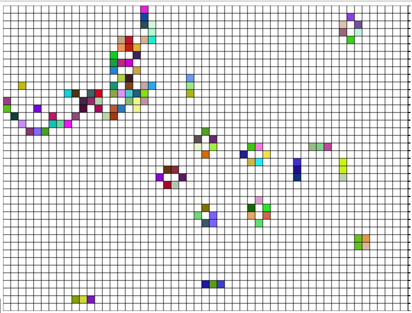

# gameOfLife
The game of life, using Javascript and canvas.

# How to play
The game will initializes random board, and run game of life until it's stable.

You can play it by:
* the right mouse button will pause/run the game.
* the middle mouse button will clear all ceils.
* the left mouse button will put/kill a ceil, you had better do it before the game being paused.

# ScreenShot

